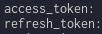

# follow-pixiv-account-from-twitter-profile
指定したユーザーがフォローしているアカウントのTwitterプロフィールからpixivアカウントをフォローするやつ.

# Requirement
* python3
* pip3
* python3-venv

# Setup
```bash
$ git clone https://github.com/addtobasic/afollow-pixiv-account-from-twitter-profile.git
$ cd follow-pixiv-account-from-twitter-profile
$ python3 -m venv venv
$ source venv/bin/activate
$ (venv) pip install -r requirements.txt
$ sed -i 's/async/async_/g' venv/lib/python3.9/site-packages/tweepy/streaming.py
```
最後のsedコマンドによるパッケージの書き換えはpython3.6以下なら実行せずに動くが3.7以上の場合はasyncをasync_に書き換えなければならないため実行する必要があります -> [issuesを参照](https://github.com/tweepy/tweepy/issues/1017)

## Get Refresh Token
pixivのユーザー認証の仕様が変わったため導入が面倒になっています

chrome右上のメニュー / 設定 / chromeについて からそのバージョンに対応するchromedriverを[こちら](https://chromedriver.chromium.org/downloads)からダウンロードしてきてgetRefreshTokenフォルダに入れてターミナルで下のコマンドを実行してください

```bash
$ cd follow-pixiv-account-from-twitter-profile/getRefreshToken
$ ls #README.md chromedriver pixiv_auth.py
$ python3 pixiv_auth.py login
```
実行するとログインページが出てくるのでダウンロードしたいブックマークの画像があるアカウントでログインします

ログインするとターミナルにaccess_tokenとrefresh_tokenが表示されます



refresh_token取得の説明が分かりにくかった場合はpixivpy製作者の説明の記事をご覧ください
[https://gist.github.com/upbit/6edda27cb1644e94183291109b8a5fde](https://gist.github.com/upbit/6edda27cb1644e94183291109b8a5fde)

## Setting the key.py
先程取得したrefresh_tokenとご自身のpixivのユーザーID (pixiv.net/users/?????/ の?????の部分の数字)でkey.pyとREFRESH_TOKENとUSER_IDを書き換えてください.

面倒ですがtwitterのデベロッパーアカウントが必要です. 頑張って英作文ガチャに成功してください. アプリケーションを作りAPI_KEY, API_SECRET_KEY, ACCESS_TOKEN, SECRET_ACCESS_TOKENを書き換えてください.

```python
REFRESH_TOKEN = "Insert your refresh token."
USER_ID = "Insert your pixiv user ID."
API_KEY = "Insert your API key."
API_SECRET_KEY = "Insert your API secret Key."
ACCESS_TOKEN = "Insert your access token."
SECRET_ACCESS_TOKEN = "Insert your secret access token."
```

## Start the follow
上記の設定が終わればターミナルで下のコマンドを実行してください
```bash
$ cd follow-pixiv-account-from-twitter-profile
$ python3 follow.py
```
これでsearch_userに設定したtwitterアカウントがフォローしているユーザーのtwitterプロフィールのwebsiteにあるpixivアカウントをフォローできていると思います.

pixivpyの仕様上, twitterに設定されたwebsiteがpixiv.meから始まるユーザーページだと直接フォローできないので最後にまとめて出力するようにしています

# References
* https://github.com/upbit/pixivpy
* https://gist.github.com/upbit/6edda27cb1644e94183291109b8a5fde
* https://qiita.com/perlverity/items/a6bd388d96cb4ce69692
